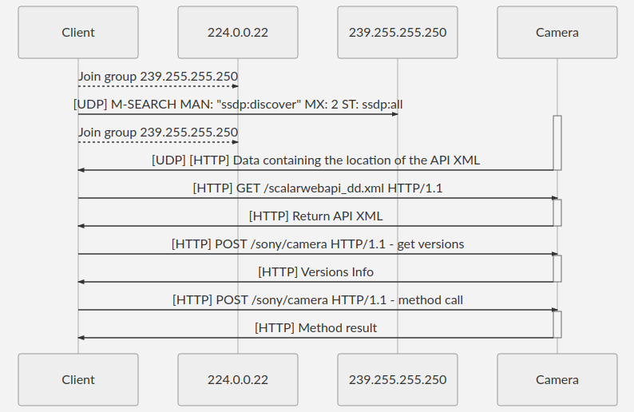

# API Traffic Capture
To decipher the API I captured the traffic between Sony's Imaging Edge Mobile application (https://play.google.com/store/apps/details?id=com.sony.playmemories.mobile&hl=en&gl=US) and the camera. 
The simplest pcap file is 3.pcap. The diagram below shows the initialisation steps, for the rest I encourage you to take a look at ConnectToCamera.ipynb in the main folder.



```mermaid
sequenceDiagram
Client -->> 224.0.0.22: Join group 239.255.255.250
Client ->> 239.255.255.250: [UDP] M-SEARCH MAN: "ssdp:discover" MX: 2 ST: ssdp:all
activate Camera
Client -->> 224.0.0.22: Join group 239.255.255.250
Camera ->>- Client: [UDP] [HTTP] Data containing the location of the API XML

Client ->>+ Camera: [HTTP] GET /scalarwebapi_dd.xml HTTP/1.1
Camera ->>- Client: [HTTP] Return API XML
Client ->>+ Camera: [HTTP] POST /sony/camera HTTP/1.1 - get versions
Camera ->>- Client: [HTTP] Versions Info

Client ->>+ Camera: [HTTP] POST /sony/camera HTTP/1.1 - <method call>
Camera ->>- Client: [HTTP] <method result>
